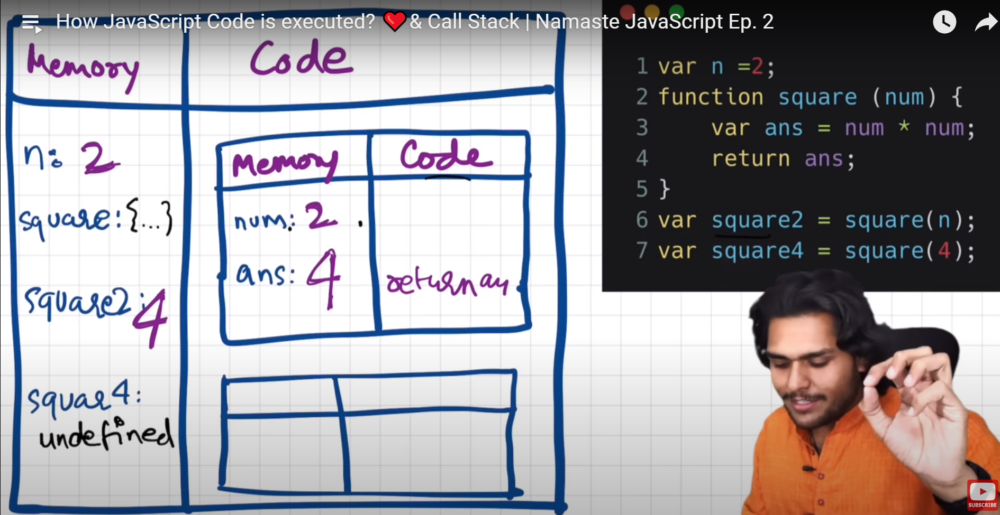
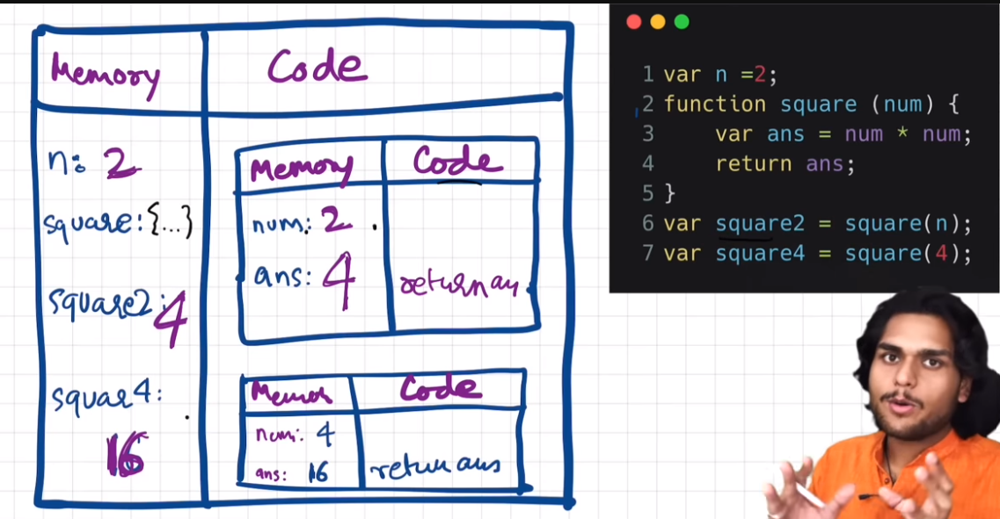

# Learning_JavaScript

### Season 02 Namaste Javascript Ep 03

1. Promise can be created using a new Promise() constructor function.

2. This constructor function takes a callback function as argument.

3. The callback function has 2 arguments named 'resolve' and 'reject'. Resolve and reject are the keywords provided by JS.

4. We can only resolve or reject a promise. Nothing else can be done.

5. An error can also be created using new Error('error message').

6. There is also .catch() which is used to attach a failure callback function that handles any error that pops up during the execution of promise chain.

7. .catch only handles error of .then() that are present above it. If there is any .then() below it, catch will not handle any error for that, also that ,then will get executed no matter what.

8. It can be useful in a way if we want to catch error for a particular portion of a chain.

9. We can have multiple catch based on requirement and then a general catch at the end.

10. Always remember to return a value in the promise chain for the next .then to use .

11. If it returns a value => It will be used as an argument in next function. If it is a promise then the next .then in the promise chain is attached to the promise returned by the current callback function.

Homework:

```jsx
const cart = ['shoes', 'pants', 'kurta'];

createOrder(cart)
  .then(function(orderId) {
    console.log(orderId);
    return orderId;
  })
  .then(function(orderID) {
    return proceedToPayment(orderID)
  })
  .then(function({ message, amt }) {
    console.log(message, 'of amount:', amt);
    return showOrderSummary(message, amt);
  })
  .then(function({ message, amt }) {
    console.log('Your wallet has beed debited by:', amt);
  })
  .catch(function(err) {
    console.log(err.message);
  })
  .then(function() {
    console.log('No matter what happens, I will get executed');
  });


function createOrder(cart) {
  const pr = new Promise(function(resolve, reject) {
    // create order
    // Validate Cart
    // orderId
    if (!validateCart(cart)) {
      const err = new Error('Cart is not valid!');
      reject(err);
    }
    // logic for createOrder
    const orderId = '12345';
    if (orderId) {
      setTimeout(function() {
        resolve(orderId);
      }, 5000)
    }
  });

  return pr;
}

function proceedToPayment(orderID) {
  // Logic for handling payment.
  // This function returns a promise
  return new Promise(function(resolve, reject) {
    // logic
    resolve({ message: `Payment Successful for order id: ${orderID}`, amt: 2500 });
  })
}

function showOrderSummary(paymentInfo, amt) {
  return new Promise(function(resolve, reject) {
    // console.log(amt);
    if (amt >= 2000) {
      resolve({ message: 'You have ordered items that cost ${amt} RS', amt });
    } else {
      reject(new Error('Please buy more for discount'));
    }
  })
}

function validateCart(cart) {
  // code to validate cart.
  return true;
  // return false;
}
```


### Season 02 Namaste Javascript Ep 02

# Promise

## Importance of promise

### Promises are important because they help us to avoid the problems we face with callbacks, namely inversion of control and callback hell. Also, promises, once resolved are immutable; thus building up immense trust. Promises are very beautiful.

1. Before promise we used to depend on callback functions which would result in

1. Callback Hell (Pyramid of doom) |
1. Inversion of control
1. Inversion of control is overcome by using promise.

2.1 A promise is an object that represents eventual completion/failure of an asynchronous operation.

2.2 A promise has 3 states: pending | fulfilled | rejected.

2.3 As soon as promise is fulfilled/rejected => It updates the empty object which is assigned undefined in pending state.

2.4 A promise resolves only once and it is immutable.

2.5 Using .then() we can control when we call the cb(callback) function.

1. To avoid callback hell (Pyramid of doom) => We use promise chaining. This way our code expands vertically instead of horizontally. Chaining is done using '.then()'

1. A very common mistake that developers do is not returning a value during chaining of promises. Always remember to return a value. This returned value will be used by the next .then()

# Execution context Diagram





# 20 Asynchronous JavaScript Interview Questions and Answers

Prepare for the types of questions you are likely to be asked when interviewing for a position where Asynchronous JavaScript will be used.

## Asynchronous JavaScript is a popular programming technique used to improve the performance of web applications. When applying for a position in web development, it is likely that employers will expect you to have a strong understanding and familiarity with asynchronous JavaScript. Understanding what asynchronous JavaScript questions you are most likely to encounter and how to properly answer them improves your chances of making a positive impression on the hiring manager. In this article, we discuss the most commonly asked asynchronous JavaScript questions and how you should respond.

#### Asynchronous JavaScript Interview Questions and Answers

#### Here are 20 commonly asked Asynchronous JavaScript interview questions and answers to prepare you for your interview:

# 1. What do you understand by asynchronous programming?

Asynchronous programming is a form of programming where code is executed in a non-blocking fashion. This means that code can be executed without waiting for other code to finish running. This can be useful for tasks that may take some time to complete, such as making network requests or accessing files. Asynchronous programming can make code more responsive and improve performance.

# 2. Can you give me some examples of real-world use cases for asynchronous programming in JavaScript?

There are many real-world use cases for asynchronous programming in JavaScript. For example, if you are trying to load data from a remote server, you will need to use asynchronous programming to ensure that the data is loaded before your code tries to access it. Other examples include working with files or databases, where you need to wait for the file or database operation to complete before moving on to the next step in your code.

# 3. How can you add a callback function to an asynchronous call in JavaScript?

In order to add a callback function to an asynchronous call in JavaScript, you will need to use the .then() method. This method takes in a function as an argument, which will be executed once the asynchronous call has been completed.

# 4. What is the difference between synchronous and asynchronous programming?

In synchronous programming, each line of code must be executed in order before the next line can run. This can lead to issues if one line of code is taking a long time to execute, as it can hold up the rest of the code from running. Asynchronous programming, on the other hand, allows for different lines of code to run at the same time. This can make code run more efficiently, as long as the different lines of code don’t need to interact with each other.

# 5. What is your understanding of the Event Loop concept in JavaScript?

The Event Loop is a mechanism used by JavaScript to handle asynchronous events. It is a continuous loop that checks for events and then processes them accordingly. This allows JavaScript to handle multiple events at the same time and makes it possible for things like animations and user input to be processed without blocking the main thread of execution.

# 6. Can you explain what the this keyword does in JavaScript?

The this keyword in JavaScript refers to the object that is currently being processed. It can be used to access properties and methods of that object.

# 7. What are event emitters in Nodejs?

Event emitters are objects that emit events. When an event is emitted, all the registered event handlers for that event are called.

# 8. Can you explain how you would deal with a memory leak in JavaScript?

There are a few different ways to deal with a memory leak in JavaScript. One way would be to simply avoid creating any variables that you don’t absolutely need. Another way would be to keep track of the variables that you do create, and make sure to delete them when they are no longer needed. Finally, you can use a tool like the Chrome Developer Tools to help identify and fix memory leaks in your code.

# 9. When should I use callbacks, promises, or async/await methods in my code?

There is no one-size-fits-all answer to this question, as the best approach to take will vary depending on the specific situation. However, in general, callbacks should be used when working with simple, synchronous operations, while promises and async/await should be used for more complex, asynchronous operations.

# 10. Why are callbacks not recommended for most applications?

Callbacks are not recommended for most applications because they can lead to code that is difficult to read and debug. When using callbacks, it is easy to create a situation where your code is “callback hell” – a situation where you have so many nested callbacks that it is difficult to follow the flow of execution. This can make your code difficult to understand and maintain.

# 11. Can you explain what the onerror() method does in JavaScript?

The onerror() method in JavaScript is used to handle errors that occur when loading a script. This is useful for debugging purposes, as it can help you track down where the error is occurring. The onerror() method takes two arguments: the first is the error message, and the second is the URL of the script that caused the error.

# 12. What do you understand about generators in JavaScript?

Generators are functions which can be paused and resumed, and they can yield values back to the caller. They are used to create asynchronous code, and can be used to improve performance by avoiding blocking code.

# 13. Do all browsers support ES6 Promises? If not, then which ones do not work well with it?

Not all browsers support ES6 Promises. In particular, older versions of Internet Explorer do not work well with Promises.

# 14. What’s the best way to implement singleton patterns using async functions in JavaScript?

The best way to implement singleton patterns using async functions in JavaScript is to make sure that the function is only called once, and then to save the result of that function call in a variable. This way, subsequent calls to the function will simply return the saved result, rather than trying to call the function again.

# 15. Can you explain what a closure is and why they are important when dealing with asynchronous code?

A closure is a function that remembers the environment in which it was created, even if that environment no longer exists. This is important when dealing with asynchronous code because it allows you to create a function that will be executed at a later time, but still have access to the variables and data that it needs.

# 16. Why do we need to use arrow functions instead of normal functions with async calls in JavaScript?

Arrow functions are necessary when working with async calls in JavaScript because they do not create their own this context. This means that the value of this inside an arrow function is always inherited from the enclosing scope, which is exactly what we need when working with async calls.

# 17. How can you avoid callback hell while writing asynchronous code in JavaScript?

One way to avoid callback hell is to use Promises. A Promise is an object that represents the result of an asynchronous operation. Promises can be used to chain together multiple asynchronous operations, so that you don’t end up with a nested mess of callbacks.

# 18. What is your opinion on batching requests to APIs?

Batching requests to APIs can be a great way to improve performance by reducing the number of round trips that need to be made. It can also help to reduce the amount of data that needs to be transferred, which can save on bandwidth. However, it is important to make sure that batching does not introduce any latency issues, as this can nega

# 19. What is the purpose of setImmediate() in JavaScript?

The setImmediate() function is used to schedule a task to be executed as soon as the event loop is free. This is useful for tasks that need to be executed right away but are not time-sensitive enough to be placed in the browser’s requestAnimationFrame() function.

# 20. Is there any other way to execute asynchronous code besides callbacks, promise, or async/wait in JavaScript?

There are a few other ways to execute asynchronous code in JavaScript, but they are generally not considered as good practice. One way is to use setTimeout, which will execute a function after a certain amount of time has passed. Another way is to use event listeners, which will execute a function when a certain event occurs.

Ref : https://climbtheladder.com/asynchronous-javascript-interview-questions/
````
