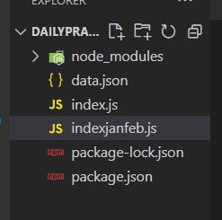

<!-- Run this code if u want to fill the htmp..... -->
Steps to follow
1. create  data.json file
2. create index.js file
3. create package.json
4. create package-lock.json

### copy all the below code and the npm init commond so all the packages installed

## for running the script use : node index.js and hit enter
 

```javascript
<!-- index.js -->

const jsonfile = require("jsonfile");
const moment = require("moment");
const simpleGit = require("simple-git");

const FILE_PATH = "./data.json";

// Define the start and end dates of the range
const START_DATE = moment("2025-01-01");
const RANGE_DAYS = 45; // 0 to 45 days added to Jan 1 gives Feb 15 at maximum

const makeCommit = (n) => {
  if (n === 0) return simpleGit().push(); // base case to stop recursive call

  // Generate a random integer between 0 and RANGE_DAYS inclusive
  const offset = Math.floor(Math.random() * (RANGE_DAYS + 1));

  // Create a commit date by adding the random offset to the start date
  const DATE = START_DATE.clone().add(offset, "days").format();

  const data = {
    data: DATE,
  };
  console.log("Commit date:", DATE);

  jsonfile.writeFile(FILE_PATH, data, () => {
    // Commit with the generated date (using --date flag)
    simpleGit()
      .add([FILE_PATH])
      .commit(DATE, { "--date": DATE }, makeCommit.bind(this, --n));
  });
};

makeCommit(100);
```

```javascript
<!-- package.json -->
{
  "name": "dailypracticecode",
  "version": "1.0.0",
  "description": "",
  "main": "index.js",
  "scripts": {
    "test": "echo \"Error: no test specified\" && exit 1"
  },
  "author": "",
  "license": "ISC",
  "dependencies": {
    "jsonfile": "^6.1.0",
    "moment": "^2.30.1",
    "random": "^5.1.1",
    "simple-git": "^3.27.0"
  }
}
```

```javascript
<!-- package-lock.json -->
{
  "name": "dailypracticecode",
  "version": "1.0.0",
  "lockfileVersion": 3,
  "requires": true,
  "packages": {
    "": {
      "name": "dailypracticecode",
      "version": "1.0.0",
      "license": "ISC",
      "dependencies": {
        "jsonfile": "^6.1.0",
        "moment": "^2.30.1",
        "random": "^5.1.1",
        "simple-git": "^3.27.0"
      }
    },
    "node_modules/@kwsites/file-exists": {
      "version": "1.1.1",
      "resolved": "https://registry.npmjs.org/@kwsites/file-exists/-/file-exists-1.1.1.tgz",
      "integrity": "sha512-m9/5YGR18lIwxSFDwfE3oA7bWuq9kdau6ugN4H2rJeyhFQZcG9AgSHkQtSD15a8WvTgfz9aikZMrKPHvbpqFiw==",
      "dependencies": {
        "debug": "^4.1.1"
      }
    },
    "node_modules/@kwsites/promise-deferred": {
      "version": "1.1.1",
      "resolved": "https://registry.npmjs.org/@kwsites/promise-deferred/-/promise-deferred-1.1.1.tgz",
      "integrity": "sha512-GaHYm+c0O9MjZRu0ongGBRbinu8gVAMd2UZjji6jVmqKtZluZnptXGWhz1E8j8D2HJ3f/yMxKAUC0b+57wncIw=="
    },
    "node_modules/debug": {
      "version": "4.4.0",
      "resolved": "https://registry.npmjs.org/debug/-/debug-4.4.0.tgz",
      "integrity": "sha512-6WTZ/IxCY/T6BALoZHaE4ctp9xm+Z5kY/pzYaCHRFeyVhojxlrm+46y68HA6hr0TcwEssoxNiDEUJQjfPZ/RYA==",
      "dependencies": {
        "ms": "^2.1.3"
      },
      "engines": {
        "node": ">=6.0"
      },
      "peerDependenciesMeta": {
        "supports-color": {
          "optional": true
        }
      }
    },
    "node_modules/graceful-fs": {
      "version": "4.2.11",
      "resolved": "https://registry.npmjs.org/graceful-fs/-/graceful-fs-4.2.11.tgz",
      "integrity": "sha512-RbJ5/jmFcNNCcDV5o9eTnBLJ/HszWV0P73bc+Ff4nS/rJj+YaS6IGyiOL0VoBYX+l1Wrl3k63h/KrH+nhJ0XvQ==",
      "optional": true
    },
    "node_modules/jsonfile": {
      "version": "6.1.0",
      "resolved": "https://registry.npmjs.org/jsonfile/-/jsonfile-6.1.0.tgz",
      "integrity": "sha512-5dgndWOriYSm5cnYaJNhalLNDKOqFwyDB/rr1E9ZsGciGvKPs8R2xYGCacuf3z6K1YKDz182fd+fY3cn3pMqXQ==",
      "dependencies": {
        "universalify": "^2.0.0"
      },
      "optionalDependencies": {
        "graceful-fs": "^4.1.6"
      }
    },
    "node_modules/moment": {
      "version": "2.30.1",
      "resolved": "https://registry.npmjs.org/moment/-/moment-2.30.1.tgz",
      "integrity": "sha512-uEmtNhbDOrWPFS+hdjFCBfy9f2YoyzRpwcl+DqpC6taX21FzsTLQVbMV/W7PzNSX6x/bhC1zA3c2UQ5NzH6how==",
      "engines": {
        "node": "*"
      }
    },
    "node_modules/ms": {
      "version": "2.1.3",
      "resolved": "https://registry.npmjs.org/ms/-/ms-2.1.3.tgz",
      "integrity": "sha512-6FlzubTLZG3J2a/NVCAleEhjzq5oxgHyaCU9yYXvcLsvoVaHJq/s5xXI6/XXP6tz7R9xAOtHnSO/tXtF3WRTlA=="
    },
    "node_modules/random": {
      "version": "5.1.1",
      "resolved": "https://registry.npmjs.org/random/-/random-5.1.1.tgz",
      "integrity": "sha512-iidvORUvXY1ItoYxO0eduHCKl22QV0G6460vRHe862dUagJKPhRyjUGwK8ioOCG4NRuFvExHFpqMngsnr2miwA==",
      "engines": {
        "node": ">=18"
      }
    },
    "node_modules/simple-git": {
      "version": "3.27.0",
      "resolved": "https://registry.npmjs.org/simple-git/-/simple-git-3.27.0.tgz",
      "integrity": "sha512-ivHoFS9Yi9GY49ogc6/YAi3Fl9ROnF4VyubNylgCkA+RVqLaKWnDSzXOVzya8csELIaWaYNutsEuAhZrtOjozA==",
      "dependencies": {
        "@kwsites/file-exists": "^1.1.1",
        "@kwsites/promise-deferred": "^1.1.1",
        "debug": "^4.3.5"
      },
      "funding": {
        "type": "github",
        "url": "https://github.com/steveukx/git-js?sponsor=1"
      }
    },
    "node_modules/universalify": {
      "version": "2.0.1",
      "resolved": "https://registry.npmjs.org/universalify/-/universalify-2.0.1.tgz",
      "integrity": "sha512-gptHNQghINnc/vTGIk0SOFGFNXw7JVrlRUtConJRlvaw6DuX0wO5Jeko9sWrMBhh+PsYAZ7oXAiOnf/UKogyiw==",
      "engines": {
        "node": ">= 10.0.0"
      }
    }
  }
}
```
3. open terminal and run command  `npm init`after the copy paste of package.json and package-lock.json



<!-- Bonus -->
```javascript
const jsonfile = require("jsonfile");
const moment = require("moment");
const simpleGit = require("simple-git");

const FILE_PATH = "./data.json";

// Define the start and end dates of the range
const START_DATE = moment("2022-01-04"); // Start date: Jan 4, 2022
const END_DATE = moment("2022-12-31");   // End date: Dec 31, 2022
const RANGE_DAYS = END_DATE.diff(START_DATE, "days"); // Total days in range

const makeCommit = (n) => {
  if (n === 0) return simpleGit().push(); // base case to stop recursive call

  // Generate a random integer between 0 and RANGE_DAYS
  const offset = Math.floor(Math.random() * (RANGE_DAYS + 1));

  // Create a commit date by adding the random offset to the start date
  const DATE = START_DATE.clone().add(offset, "days").format();

  const data = {
    data: DATE,
  };
  console.log("Commit date:", DATE);

  jsonfile.writeFile(FILE_PATH, data, () => {
    // Commit with the generated date (using --date flag)
    simpleGit()
      .add([FILE_PATH])
      .commit(DATE, { "--date": DATE }, makeCommit.bind(this, --n));
  });
};

// Generate 100 random commits within the given range
makeCommit(400);

```